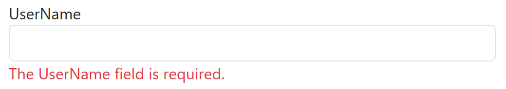

10 USER MANUAL
==============

10.1 Actions are available to all users
---------------------------------------

When you click on a web link, the home page opens by default (Figure 10.1). On it you can see 2 main tabs that are available to the user without prior authorization: Restaurants and Login.

Figure 10.1 - Start page

When you click on the Restaurants tab, a list with restaurants appears (Fig. 10.2). When you hover over a restaurant, detailed information is displayed, and when you click, you are redirected to interact with this restaurant by adding the Details segment to the link (Fig. 10.3).

In addition to basic information about the establishment, the Details tab also contains links to the menu and table reservation (Fig. 10.3, a). Comments are located at the bottom (Fig. 10.3, b). Only users of the system who are authorized as customers can leave comments, but everyone has the right to view them.

Figure 10.2 - Displaying a list of catering establishments

a)

b)

Figure 10.3 - Detailed information about the catering establishment

When you click on the link in the menu, a list of dishes opens as shown in Fig. 10.4

Figure 10.4 - Menu of a catering establishment

When you go to table reservation, a page with a display of tables in 2D space opens (Fig. 10.5). When you select any table, the interface changes to a list of available reservation times (Fig. 10.6). After that, the last page opens - the booking confirmation page. It is available only to authorized users, so the user will be prompted by default to log in (Fig. 10.7)

Figure 10.5 - Table selection page

Figure 10.6 - The page of available time for selection

Figure 10.7 - Message about the need to log in

10.2 Authorization
------------------

To access more pages and actions, you need to log in. To do this, go to the Login tab and enter your user data (Fig. 10.8). If the data is entered incorrectly, the system notifies you of the error (Fig. 10.9).

Figure 10.8 - User authorization

Figure 10.9 - Message about authorization error

If the user is not yet registered in the system, he or she can create an account for the "Client" group by going to the registration form (Figure 10.10). Similarly to the authorization form, this form contains an error message if the user has entered an existing name, skipped one of the fields, or entered an incorrect character.

Figure 10.10 - Registration form

10.3 Client opportunities
-------------------------

When logging in as a group customer, no additional links appear. However, now the user is able to leave a review about the restaurant (Fig. 10.11) and continue the table reservation process (Fig. 10.12).

Figure 10.11 - Form for filling out a review for a catering establishment

а)

b)

Figure 10.12 - Completing the table reservation process

10.4 Administrator interface
----------------------------

The administrator should be able to manipulate information about the institutions and their owners. To do this, a new field appears in the main menu - Services with a drop-down list of options (Fig. 10.13).

Figure 10.13 - Drop-down list for Service menu item

When you go to the Restaurants tab, a list of restaurants in the system appears (Figure 10.14). This list can be edited by adding new restaurants, modifying existing ones, or deleting them.

Figure 10.14 - List of restaurants in the system

The interface for creating a new restaurant and editing an existing one is the same (Figure 10.15). They contain basic information about the restaurant and opening hours.

Figure 10.15 - The page for editing a catering establishment

Another tab that is available when you hover over Service - Owners contains a list of owners (Figure 10.16). You can create new owners (Figure 10.17) or delete existing ones.

Figure 10.16 - List of owners of catering establishments

Figure 10.17 - Interface for creating an institution owner

10.5 Owner interface
--------------------

The owner has a similar management interface to the administrator. It has a page for viewing and editing establishments, but only those that are owned by the owner and without the ability to change their owner. The main difference is the ability to view orders for each establishment (Fig. 10.18) and analytical comparison of the establishment's attendance for each day during the month or for each month during the year (Fig. 10.19).

Figure 10.18 - Viewing orders in a restaurant

Figure 10.19 - Comparison of the number of bookings for a certain period of time